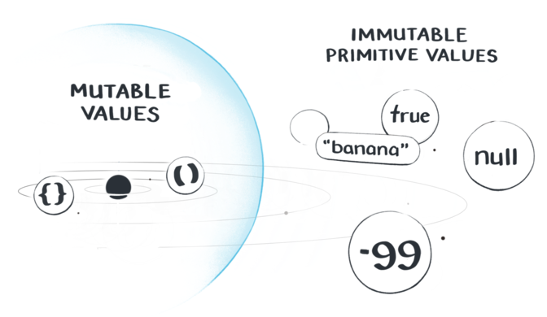

# Week 1

### Overview

Broadly, there are two kinds of values.

- **Primitive values:**  Numbers, strings, booleans, null, undefined. You can point to them, but you can't change them. Immutable.
- **Reference values:** Objects, arrays, functions. They are mutable. You can change them.



>Everything in JavaScript is not an object. A string has properties and methods but JavaScript just creates a temporary object to access them. This is called boxing (primitive value wrapped in an object)

An **expression** in JavaScript is a piece of code that produces a value. 

```js
console.log(1 + 2); 

// 1 + 2 is an expression that produces the value 3

console.log(3);

// 3 is an expression that produces the value 3
```

A **statement** in JavaScript is a piece of code that performs an action. It doesn't produce a value.

```js
let x = 1 + 2;
```

Resources:
 - <a href="https://www.codecademy.com/article/what-is-programming">What is Programming?</a> 
 - <a href="https://javascript.info/hello-world#the-script-tag">The "script" tag - embedding JavaScript in the browser</a>
 - <a href="https://code.visualstudio.com/download">Visual Studio Code</a>
 - <a href="https://javascript.info/devtools">Developer console</a>
 - <a href="https://www.ladybug.dev/episodes/debugging">Ladybug Podcast - Debugging</a>
 - <a href="https://javascript.info/types">Data types</a> 
 - <a href="https://javascript.info/variables">Variables</a>
 - <strong>Note:</strong> <a href="https://github.com/getify/You-Dont-Know-JS/blob/1st-ed/types%20%26%20grammar/ch1.md#values-as-types">Values have types, not variables</a>.
 - Expressions:
    - <a href="https://exploringjs.com/impatient-js/ch_syntax.html#statement-vs-expression">Expressions vs statement</a>
    - <a href="https://javascript.info/operators#maths">Math operators</a>
    - <strong>note:</strong> <a href ="https://www.youtube.com/watch?v=PZRI1IfStY0">Floating point math</a>
    - <a href="https://javascript.info/operators#assignment">Assignment operators</a>
    - <a href="https://javascript.info/logical-operators">Logical operators</a>
    - <a href="https://javascript.info/comparison">Comparison operators</a>

 - Extra Coding Practice:
   - <a href="https://exercism.org/tracks/javascript">Exercism</a>
   - <a href="https://www.freecodecamp.org/learn/javascript-algorithms-and-data-structures/#basic-javascript">FreeCodeCamp.org<a/>
   
 - Additional:
   - <a href="https://roadmap.sh/frontend">Frontend Roadmap</a>
   - <a href="https://javascript.info/">JavaScript.Info</a>
   - <a href="https://www.w3schools.com/js/default.asp">W3Schools.com</a>
   - <a href="https://developer.mozilla.org/en-US/docs/Web/JavaScript">MDN Web Docs</a>
   - <a href="https://wesbos.com/javascript">Wes Bos JavaScript Reference</a>
   - More technical (not required):
     - <a href="https://www.youtube.com/watch?v=9ooYYRLdg_g">Primitive Data Types Under the Hood</a>
     - <a href="https://www.youtube.com/watch?v=uut8y9RHG48">JavaScript Under the Hood</a>
     - <a href="https://www.youtube.com/watch?v=BMKWdLX9w3M">JavaScript engine</a>
     - <a href="https://github.com/getify/You-Dont-Know-JS/blob/2nd-ed/scope-closures/ch1.md#compiled-vs-interpreted">Compiling vs Interpretation</a>
     - <a href="https://www.youtube.com/watch?v=BHttnG4kOdY">JavaScript JIT (Just in Time) Compilation</a>
     - <a href="https://www.youtube.com/watch?v=C06MohLG_3s">What is an AST (Abstract Syntax Tree)?</a>