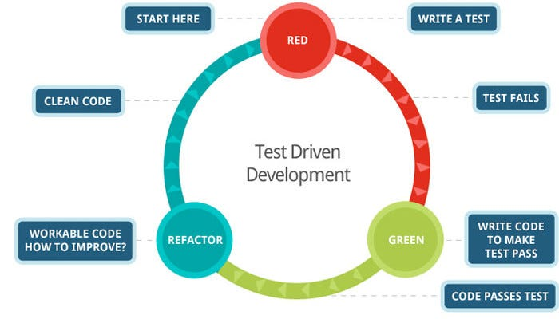

# Week 6

### Node

Node is a `javascript runtime environment`.

Javascript has been around since 1995 and for a while it was only used inside of a browser environment, meaning that was the only place we could use it.

This meant that developers were having to code in multiple languages to create a front-end and back-end to their applications.

When Node came out, it allowed developers to write Javascript code that runs directly on the computer process itself, rather than being confined to a browser environment. This means that Node can be used to write server-side applications that have full access to the operating system, file system, etc.

Node was written in `C`, `C++`, and `Javascript`. It was built on top of the `V8 Javascript` engine. This is the same engine that browsers like `Google Chrome` use.

#### Running A Javascript File

We can execute a JS file by running the terminal command

```bash
$ node "name of file to execute"
```

This will turn the terminal into an interactive javascript environment.

### Using NPM 

To be able to install and use any package (aka library or framework) you should first execute the command ```npm init```. This command initializes your project with a package.json file which is a .json file with a object literal with keys and values that describe your project.

If you do not do ```npm init``` first, the first time you install your first package, a package.json file will be created anyways. 

Every package that you install will be installed to a node_modules folder. This folder (will be created if not already there) contains the executable source code for each package that you install.

<strong>Note:</strong> Never push your `node_modules` folder to your Github repo. Always create a .gitignore file and put the folder name there so git will ignore those folder(s) and file(s). 

#### Package.json
Your project's package.json is the central place to configure and describe how to interact with and run your application. It enables npm to start your project, run scripts, install dependencies, publish to the NPM registry, and many other useful tasks. 

Your package.json fills several roles in the lifecycle of your project, some of which only apply for packages published to NPM. If you're not publishing your project to the NPM registry or otherwise making it publicly available to others, your package.json is still essential to the development flow.

#### Package-lock.json

When you install the first package using npm a new file called ```package-lock.json``` appears in your project directory. This file helps lock package dependencies down, as well as their sub-dependencies. 

When you install a package, most likely that package will have many dependencies and sub-depenedencies in order for it to run. 

So why doesn't the ```package.json``` handle all this? Good question.

The package.json file only handles top-level dependencies, nothing more. But those dependencies may have their own dependencies, etc. Like if we use the very loose analogy of you know about your 1st cousins, but you may have forgotten about you 2nd and 3rd cousins. 😧

The package-lock file is a snapshot of our entire dependency tree and all the information npm needs to recreate the state of our node_modules/ folder. 

#### NPM Script

An npm script is a convenient way to bundle common shell commands for your project. They are typically commands, or a string of commands, which would normally be entered at the command line in order to do something with your application.

Scripts are stored in a project's package.json file, which means they're shared amongst everyone using the codebase. They help automate repetitive tasks, and mean having to learn fewer tools. Node npm scripts also ensure that everyone is using the same command with the same flags.

```JS
"scripts": {
    "start": "http-server --cors -c-1 -p 8080"
  },
```

### Testing: What and Why?

Testing refers to the process of writing tests for our code based on what we expect to happen and 
then running our code against those tests. Our code will be considered successful if it passes the 
tests that we write for it. 

The idea is that we determine from the start what we expect a function or a component to do, 
write tests to reflect these expectations, and then put our components up against these tests. 
If they behave the way we expect, then we can move on. Otherwise, we need to refactor our code 
to pass the tests. 

There are several common kinds of testing in the development world:

- Unit Testing: Used to test a single function.
- Endpoint Testing: Used to test an endpoint. Postman tests would be an example of this.
- Component Testing/Mocking Components: Testing a component in a simulated environment
- End to End Testing: Simulates a user interacting with the website.

Traditionally, testing is handled by QA engineers but there is a trend emerging of test driven development:



There is a huge need for developers who know how to test their code and the more familiar you become with it,
the more valuable you will be to a future employer. 

Benefits of testing:

- You know exactly what you expect to happen right from the start. This reduces debugging time as it allows 
  you to develop in a more isolated environment.
- It created automatic documentation for your project
- Allows you to think through your logic beforehand and find any holes you may not have intended.

### Jest

- Developed and maintained by Facebook.
- Jest is a test runner (aka testing environment). It goes and runs your test.
- Jest is also a assertion library. It verifies that things are correct.
- Jest also does mocking (fake data or fake functions) for more inclusive tests.
- Jest uses Jasmine behind the scenes (assertion library and framework).
- Note: Jest does the same as Mocha (framework) and Chai (assertion library).

Let's write our first unit test:

1. Create a `__tests__` folder and a `functions.js` file in the root folder.
   > The functions file is for showing off jest functionality. These functions can come from anywhere
2. Create a `functions.test.js` file in the `__tests__` folder. This file will be used to test our functions in `functions.js`.
3. Let's look at what goes into writing a unit test using Jest:

```js
const { sum, sayHello } = require('../functions')
//Import our functions to be tested

//We set up a unit test using the following syntax:
test('adds 1 + 2 to equal 3', () => {
  //The test function is provided to us by Jest and is available globally
  //We provide it with two arguments: a description of our test and a callback function.  This callback function is our test.

  expect(sum(1, 2)).toBe(3)
  //In this case we are testing if our sum function is able to add 1 and 2 together.
  //We use the expect keyword to expect a certain value and the toBe matcher to determine what we expect the value to be.
  //In this case, we expect the invocation of sum with 1 and 2 passed as arguments to be 3.
})
```

Run `npm run test` to run our tests. You will see in the console whether your tests pass or not. Let's write another test in the same file:

```js
test('sayHello says hello', () => {
  expect(sayHello()).toBe('hello')
})
```

Let's look at some other matchers available to us through Jest. Include the following tests in our `functions.test.js` file:

```js
// Checking the value of an object
test('object assignment', () => {
  const data = { one: 1 }
  data['two'] = 2
  expect(data).toEqual({ one: 1, two: 2 })
  //toEqual is for more complex values, can check objects
})

test('Expect true to be truthy', () => {
  expect(true).toBeTruthy()
})

//Checking an array contains an items
let names = ['John', 'Ariel', 'Zach']
// let names = [{id: 1, name: 'John'}]

test('Names contains Ariel', () => {
  expect(names).toContain('Ariel')
})
```

One of the most important matchers in Jest is the `not` matcher. This allows you to flip any matcher. Let's look at some examples:

```js
test('Add 1 and 2 to equal 3', () => {
  expect(sum(1, 2)).toBe(3)
  expect(sum(1, 2)).not.toBeNaN()
  //You can append not before any matcher to flip what it checks for
})

test('Names contains Becca', () => {
  expect(names).toContain('Becca')
  expect(names).not.toContain('Preston')
})
```

There are a ton of matchers available in Jest you can see them [here](https://jestjs.io/docs/en/expect)

Above you will see that we grouped two tests together. This is not the correct way to do things because each test should exist in isolation. Each test should not be dependent on any other test passing or failing. If we need to group tests together, there is a better way to do it, a `describe` block. This functions like a test block but holds related tests. Even though they are grouped together, they exist independently of each other.

Create a new file called `bankAccount.test.js` in your `__tests__` directory. We will be using the object provided in `bankAccount.js` to run multiple tests together.

```js
import bankAccount from '../bankAccount'

//The describe block is provided by Jest and allows us to group tests together while allowing them to pass or fail independently of each other.
describe('Bank account methods and properties', () => {
  //Describe takes a description and a callback function which will contain the tests we want to run.
  beforeEach(() => {
    //Inside of a describe block, we have access to test setup and teardown.
    //Here this function will run before each test in our describe block but we can also use: beforeAll, afterAll, afterEach
    bankAccount.balance = 1000
  })

  //Try to walk yourself through what each of the below tests is doing.
  test('Initial balance is 1000', () => {
    expect(bankAccount.balance).toBe(1000)
  })
  test('depositMoney should correctly alter balance', () => {
    bankAccount.depositMoney(2000)
    expect(bankAccount.balance).toBe(3000)
  })
  test('withDraw should correctly alter balance', () => {
    bankAccount.withdrawMoney(2000)
    expect(bankAccount.balance).toBe(-1000)
  })
})
```

Resources:

- Node
  - [Overview and setup](https://www.youtube.com/watch?v=zb3Qk8SG5Ms)
  - [Documentation](https://nodejs.org/docs/latest-v19.x/api/)
  - [Download](https://nodejs.org/en/download)
- Npm:
   - [What is package.json?](https://heynode.com/tutorial/what-packagejson/)
   - [What are NPM scripts?](https://heynode.com/tutorial/what-are-npm-scripts/)
   - [What is package-lock.json?](https://heynode.com/tutorial/what-package-lockjson/)
   - [Creating a .gitignore file](https://www.freecodecamp.org/news/gitignore-what-is-it-and-how-to-add-to-repo/)
- Testing:
   - <a href="https://jestjs.io/docs/getting-started">Getting Started docs</a>
- <a href="https://www.youtube.com/watch?v=7r4xVDI2vho&t=583s">Crash Course</a>
- <a href="https://www.smashingmagazine.com/2020/06/practical-guide-testing-react-applications-jest/">Types of Testing with Jest</a>