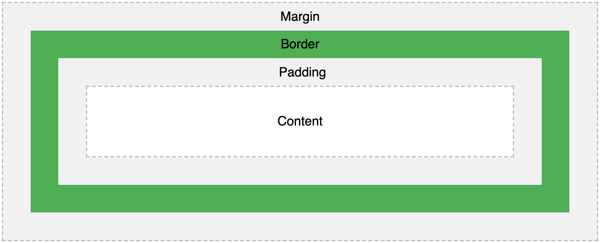
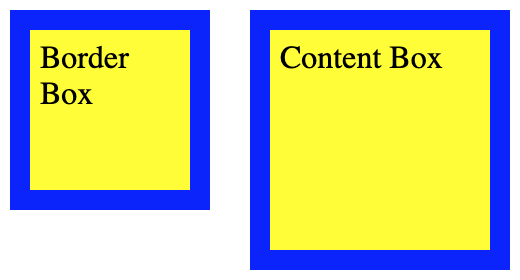
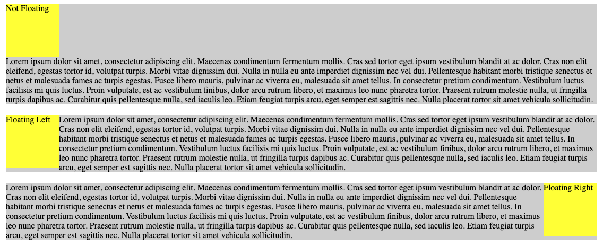

# Week 2

## CSS

CSS, which stands for Cascading Style Sheets, is another building block language of the web. CSS is a presentational language that is used only for the _styling_ and _layout_ of a page. CSS files are files that have the `.css` extension.

### How to Write CSS

<details>
    <summary>Information</summary>
    
    
There are three main ways to write CSS:

1. **Inline CSS** - Inline CSS is created per element by using the `style` attribute on the element. Inline CSS is not considered best-practice as it bloats files, it makes it difficult to make broad styling changes, and it can become difficult to pin point where the styling of a page is coming from.

Inline CSS Example:

```html
<button style="color:red;font-size:14px">Button Text</button>
```

2. **Internal CSS** - Internal CSS is when CSS written inside of the `<style>` tag of an HTML document. This `<style>` tag should be written inside of the `<head>` tag of the html. Internal CSS can bloat a file and make it more difficult to comprehend, and is consequently not considered best-practice.

Internal CSS Example:

```html
<!DOCTYPE html>
<html lang="en">
  <head>
    <style>
      h1 {
        background-color: red;
      }
    </style>
    <title>Document</title>
  </head>
  <body>
    <h1>I'm a header</h1>
  </body>
</html>
```

3. **External CSS** - External CSS is when CSS is brought in via an external stylesheet separate to the HTML file, and then brought in using a `<link>` tag in the `<head>` of an HTML document. The `href` attribute of the `<link` should point to the stylesheet, and the `type` attribute should specify that the file is a stylesheet. 

External CSS Example:

```html
<head>
  <link rel="stylesheet" type="text/css" href="stylesheet.css" />
</head>
```

</details>

### Reset or Normalize CSS

By default, browsers apply their own set of styling rules to the elements inside of an HTML file. For example, buttons, headings, paragraphs, and other elements come by default with some margin, padding, borders, and other CSS styling. Developers can use a `reset css` or `normalize css` file to remove all default styling from a browser, and essentially start from scratch with total control over the styling of a page.

> Note: You may also want to add `box-sizing: border-box` to your reset css in order to enable more predictable control of the height of elements.

### CSS Selectors

Selectors are patterns used to select the elements to be styled. Selectors are followed by a set of curly braces called "declaration blocks", which contain individual semi-colon separated style declarations. The individual style declarations are comprised of two main parts, a property and a value for that property.

> Note: Each declaration block can contain multiple style declarations.

The general syntax for a declaration block and style declarations looks like this:

```css
selector {
  property1: value;
  property2: value;
}
```

#### Common Selectors

Here are some of the more commonly used simple selectors along with example syntax:

<details>
    <summary>Element Selector (tagname)</summary>
    
  The element selector selects HTML elements by their tag name.
   
  Example: 
  ```css
  nav {
    background-color: purple;
  }
  ```
</details>

<details>
    <summary>Id Selector (#)</summary>
    
   Selects HTML elements by their `id` attribute value. Id selectors must be prefixed with a `#`. 
   
  ```css
  #some-id {
    background-color: purple;
  }
  ```
 
 </details> 
    
<details>
    <summary>Class Selector (.)</summary> 
    
   Selects HTML elements by their `class` attribute value. Class selectors are prefixed with a `.`
   
   ```css
  .some-class {
    background-color: purple;
  }
  ```   
  </details>
      
<details>
    <summary>Universal Selector (*)</summary> 
    
   Selects all HTML elements on the page using the `*` symbol
   
   ```css
   * {
    background-color: purple;
  }
  ```
   
  </details>

#### Combinators

Selectors can also be used with "combinators" for more specific styling. Below are some examples of combinators.

<details>
    <summary>Group Selector (,)</summary>
    
   Combines multiple selectors to apply the same styling block. 
    
   Example: 
   ```css
   div, p, h1, h2 {
        background-color: tomato;
   }
   ```
    
</details>

<details>
<summary>Descendant Selector (space)</summary>

Applies to the right-most selector, which is a descendant of the selector(s) to the left.

```css
div p {
  background-color: tomato;
}
```

</details>

<details>
    <summary>Child Selector (>)</summary>
    
   Targets only *direct* children of a particular selector. 
   
   Example: 
```css
    div>p {
        background-color: tomato;
    }
 ```
</details>

<details>
    <summary>Adjacent Sibling Selector (+)</summary>
    
   Targets only the first sibling of a given selector if they share the same parent. 
   
   Example: 
```css
    div + p {
        background-color: tomato;
    }
 ```
</details>

<details>
    <summary>General Sibling Selector (~)</summary>
    
   In contrast to the adjacent sibling selector, the general sibling selector selects all instances of siblings to the specified selector. 
   
   Example: 
 ```css
    div ~ p {
        background-color: blue;
    }
 ```
</details>

#### Pseudo-classes

Pseudo-classes are keywords that can be added to a selector to specify a special state of the selected elements. For example, `:hover` can be used to change an element's color when a user's pointer hovers over the element.

Example:

```css
button:hover {
  color: blue;
}
```

There are a number of psuedo-class selectors, and they can be chained together. Some of the more commonly used pseudo-classes are `:hover`, `:active`, and `:focus`. For a list of all pseudo-classes and more information about them, see here: https://developer.mozilla.org/en-US/docs/Web/CSS/Pseudo-classes

### CSS Specificity

CSS Specificity refers to a set of rules that browsers use to determine which styles are applied when there is a conflict. The built in rules work on a point evaluation system. Each type of selector has a different point value given to it. The style that is ultimately applied comes from whichever selector has the highest point value. 

> Note: Keep in mind that CSS executes top-to-bottom, and this can affect your styling too.

<details>
<summary>Point System</summary>

`Inline Styling` - 1000 pts. Inline styles always override styles declared in an external stylesheet.

`Id Selector` - 100 pts.

`Class Selector` - 10 pts.

`Element selector` - 1pt.

`!important` - Can be used to override all other denoted styles. You should avoid using `!important` at all costs, as it can make debugging CSS considerably more difficult. It is better to sort out where styling is coming from rather than resort to `!important` when dealing with undesirable effects.

> Note: Universal selectors, combinators (>, +, etc.) have no effect on CSS specificity.

</details>

You can use a <a href="https://specificity.keegan.st/">Specificity Calculator</a> to easily know the specificity of a selector.

### Box Model

All HTML elements can be thought of as boxes. In CSS, the "box model" is used when talking about the design and layout of elements, and it can be thought of essentially as a 4 part box that wraps around every element.

Here's a visual representation:


Here's a brief description of each part:

1. **Margin** - The white space that separates one element from another
1. **Border** - The border of the box that separates the padding from the margin.
1. **Padding** - The "padding" or buffer space between the content of an element and its border.
1. **Content** - The space allocated to the actual content of an element, which may be text, images, etc.

### Box-sizing Property

The box-sizing CSS property determines how the total width and height of an element is calculated. This property accepts two values, `content-box` or `border-box`. Their behavior is as follows:

- `box-sizing: content-box` - This is the initial and default value as specified by the CSS standard. The width and height properties include the content, but does not include the padding, border, or margin.
- `box-sizing: border-box` - The width and height properties include the content, padding, and border, but do not include the margin. Note that padding and border will be inside of the box.

Example CSS:

```css
#border-box {
  box-sizing: border-box;
  width: 100px;
  height: 100px;
  border: solid blue 10px;
  padding: 5px;
  background-color: yellow;
}

#content-box {
  box-sizing: content-box;
  width: 100px;
  height: 100px;
  border: solid blue 10px;
  padding: 5px;
  background-color: yellow;
}
```

Result:



### Floats

The `float` property places an element on the left or right side of it's container, and allows text and inline elements to wrap around it. The `clear` property can be used to prevent text or inline elements from wrapping around an element, and it can specify the left, right, or both sides.

See the visual example of floats below:


### Colors

Appropriate use of colors on a webpage can help set a website apart, and make the site more engaging and appealing to users.

See this blog post for examples of well designed color schemes: https://visme.co/blog/website-color-schemes/

For useful tools in creating your own color schemes and gradients, visit the following sites:
https://coolors.co/
https://cssgradient.io/

### Text Properties and Fonts

Text on a web page can be manipulated through various properties in CSS. Here are a few:

- `font-size` - changes the size of a font
- `font-weight` - controls how bold the font appears
- `color` - changes the color of the text inside of an element
- `line-height` - determines the space between two inline elements
- `text-align` - defines the horizontal alignment of text within the content box of an element
- `font-family` - determines the font family of the text on the page
- `letter-spacing` - determines how much white space should be between each character

We can also bring in fonts that are not native to a browser through `<link>` tags in our HTML. Here's an example of what that looks like:

```html
<!DOCTYPE html>
<html lang="en">
  <head>
    <link
      href="https://fonts.googleapis.com/css?family=Liu+Jian+Mao+Cao&display=swap"
      rel="stylesheet"
    />
  </head>
  <body>
    <!-- Content of page-->
  </body>
</html>
```

### Background Properties

These are properties that we can use to modify the background appearance of an element. Colors as well as images can be used as backgrounds for elements.

Here's a brief overview of some of the background properties:

- `background-color` - can be used to assign a background color to an element.
- `background-image` - can be used to assign an image as a background for an element. The element itself will appear on a layer above the background.
- `background-size` - determines the size of a background image. The image can be left to its natural size, stretched, or constrained to fit the available space.
- `background-position` - can be used to adjust the alignment of the background image. Some of the possible values include `center`, `top`, `bottom`, `right`, `left`, and x/y coordinates.
- `background-repeat` - can be used to set if/how a background image will be repeated.

### Units

CSS has a number of units for expressing length, and they fall into two main categories, "absolute" and "relative" units.

<details>
    <summary>Absolute Units</summary>
    
* `px` - pixels (1px = 1/96th of 1in)
* `pt` - points (1pt = 1/72 of 1in)
</details>

<details>
    <summary>Relative Units</summary>
    
* `em` - Relative to the font-size of the element (2em means 2 times the size of the current font)	
* `rem` - Relative to font-size of the root element	
* `vw` - Relative to 1% of the width of the viewport*	
* `vh` - Relative to 1% of the height of the viewport*	
* `%` - Relative to the parent element
</details>

### Mockups

Mockups are essentially sketches that represent the way a web site should look. In the development world, it is common for companies to have a design team or UX/UI team (User Experience, User Interface) that provides mockups to developers in order to create a site. It is important to note that these mockups are _not_ code, so it is up to the developers to find a way to actually bring the mockup to life.

Mockups can be as simple as a sketch on paper or a "wireframe", or as complicated as a high fidelity, highly detailed, and even interactive mockup built using illustrating software.

> Note: For a useful tool for creating your own mockups, see https://www.figma.com/

## Responsive Design

Responsive design is the process of building an application's user interface (UI) to dynamically adjust based on the size of the device being used to access it.

Older websites were not designed with responsive design principles in mind, and this has lead to undesirable user experiences. Take a look at https://www.spacejam.com/archive/spacejam/movie/jam.htm for an example of an unresponsive website.

Nowadays, it is standard practice to ensure that websites are responsive. Some examples of responsive designs can be found here: https://www.awwwards.com/50-examples-of-responsive-web-design.html.

The reason responsive design is important is because increasing numbers of users are consuming the internet via mobile devices or tablets. In 2017, there were an estimated 3.5 billion web users world wide, and around 2 billion of them exclusively use the internet on mobile devices. Nowadays, it is a requirement in any front-end developer position to be capable of designing responsive websites.

When building your application, there are three main devices to develop for: **Mobile**, **tablet**, and **desktop**.


### Extraction

The **extraction** design process of building an application is when developers start from desktop design, and then "extract" features until the design fits smaller devices.

The extraction design process often results in a desktop application that is rich with features, and a mobile application that feels like an ineffective afterthought. This is because it can be difficult to include all of the features from the desktop view when working with a mobile sized viewport. With extraction design, mobile views can be left feeling either cluttered and clunky, or less usable and effective than the desktop design.

### Enhancement

The **enhancement** design process is when developers begin by deciding the core features and layout for the mobile view, and then "enhance" the application in order to fill out the desktop design.

This will allow you to add features into your app as you scale up with the view port size. This is also known as "mobile first" development. This process more reliably results in a robust mobile view and an equally effective desktop design.

In short, it's easier to scale up than it is to scale down.

### Media Queries

In CSS, we can use **media queries** to help create a "responsive design".

A media query is a set of CSS rules that will apply to devices based on the viewport size of the device being used to access the page.

The syntax for writing a media query looks like the following:

```css
@media (max-width: 500px) {
  /* New Styles To Apply Based On Width */
  body {
    background: tomato;
  }
}
```

Media queries are defined in CSS by using the `@media` statement. In the parentheses, we can specify the dimensions of the view port that our styles will apply to. The value passed into the parentheses can be referred to as a **break point**. Typically, break points are set with a `min-width` or `max-width` value. Inside the curly braces, we style normally.

#### Other Uses

Media queries can be implemented in CSS sheets themselves as seen above, as well as in the link to a specific stylesheet as seen below

```HTML
<link rel='stylesheet' media='all' href='normal.css' />
<link rel='stylesheet' media='print' href='print.css' />
<link rel='stylesheet' media='screen and (min-width: 701px)' href='medium.css' />
```


#### Min-Width

Min-width is the value used to declare the minimum width of screen size that the styling block will be applied to. This means that the styles will be applied when the view port width is higher than the `min-width` value.

```css
@media (min-width: 500px) {
  /* Styles will only be applied when view port width is 500px and above */
  body {
    background: orange;
  }
}
```

### Max-Width

Max-width is the value used to declare the maximum point of screen width that the styling block would apply to. This means that the styles will be applied if the view port width is smaller than the `max-width` value.

```css
@media (max-width: 500px) {
  /* Styles will only be applied when view port width is 500px and lower */
  body {
    background: orange;
  }
}
```

You can use `max-width` or `min-width` interchangeably, but it's best to stick with one or the other to make your code more clear.

## Additional Resources

- [CSS Cheatsheet](https://devhints.io/css)
- [CSS Reset](https://meyerweb.com/eric/tools/css/reset/)
- [CSS Normalize](https://necolas.github.io/normalize.css/)
- [The New CSS Reset](https://github.com/elad2412/the-new-css-reset)
- [Web Dev - Learn CSS Course](https://web.dev/learn/css/)
- [CSS Diner Game](https://flukeout.github.io/)
- [CSS Validator](https://jigsaw.w3.org/css-validator/)
- [Free Scrimba HTML and CSS Course](https://scrimba.com/learn/htmlcss)
- [Colte Steele - CSS Text Properties](https://www.youtube.com/watch?v=v9Hqy5Nxthc)
- [Colte Steele - Box Model](https://www.youtube.com/watch?v=M1xEi_BBW1I)
- [Colte Steele - CSS Selectors](https://www.youtube.com/watch?v=qj20o5UQ3qI)
- [Colte Steele - CSS Units](https://www.youtube.com/watch?v=fi81bovqxXI)
- [Colte Steele - Specificity](https://www.youtube.com/watch?v=5Jpu2YrqzN0)
- [Flexbox Guide - CSS Tricks](https://css-tricks.com/snippets/css/a-guide-to-flexbox/)
- [Flexbox Froggy Game](https://flexboxfroggy.com/)
- [Flexbox Cheatsheet](https://yoksel.github.io/flex-cheatsheet/)
- [Flexbox Crash Course - Traversy Media](https://www.youtube.com/watch?v=3YW65K6LcIA)
- [Flexbox Video Tutorials - Wes Bos](https://www.youtube.com/playlist?list=PLu8EoSxDXHP7xj_y6NIAhy0wuCd4uVdid)
- [CSS Grid Guide - CSS Tricks](https://css-tricks.com/snippets/css/complete-guide-grid/)
- [CSS Grid Tutorial](https://learncssgrid.com/)
- [CSS Grid Article - Smashing Magazine](https://www.smashingmagazine.com/2020/01/understanding-css-grid-lines/)
- [CSS Grid Video Tutorials - Wes Bos](https://www.youtube.com/playlist?list=PLu8EoSxDXHP5CIFvt9-ze3IngcdAc2xKG)
- [CSS Grid Cheatsheet](https://yoksel.github.io/grid-cheatsheet/)
- [CSS Grid Game](https://cssgridgarden.com/)
- [CSS Grid vs Flexbox](https://www.youtube.com/watch?v=18VLSXfsj94&t=4s)
- [Web Dev - Learn Response Web Design](https://web.dev/learn/design/)
- [Conversation with Ethan Marcotte (creator of term RWD)](https://www.youtube.com/watch?v=iiLKVmxCxEU)
- [RWD Podcast - Old episodes (but still useful)](https://responsivewebdesign.com/podcast/)
- [Material Design - Google's Design System](https://material.io/develop/web)