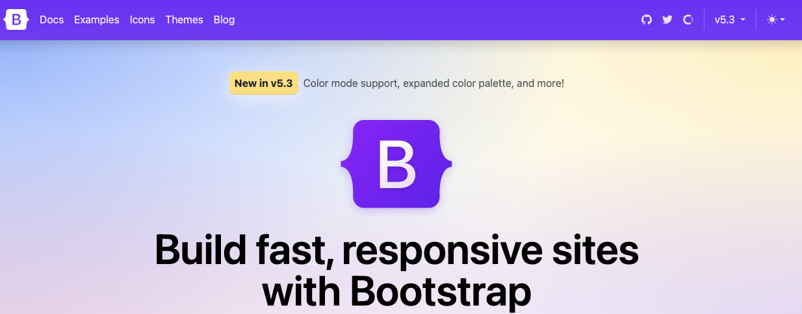

# Week 3

## Bootstrap Overview 

Bootstrap is a framework of readily available code that integrates with HTML to create stylized websites that adapt the layout to users’ screen sizes. This framework allows developers to cut down on the time needed to style a website, simplifies the complexity of how to layout elements, works across multiple browsers, and reduces the frustration of using plain CSS. All it takes to use Bootstrap is a few additional lines in our HTML document.

There are also some optional JavaScript libraries if we want to add some interactivity to our website and these are inserted at the end of our <body> element. 



### Installation

There are multiple ways to use the Bootstrap framework:
  - Use the CDN links
  - Download the compiled CSS and JS
  - Install Bootstrap via npm (I prefer this one)

Check out the <a href="https://getbootstrap.com/docs/5.0/getting-started/download/">downloads page</a> for more information.

### Layout - Grid

Bootstrap constructs a horizontal grid on the page, and the elements are placed within. This is the fundamental part of the framework, and how to deal with the grid and its options is the first decision you make in your project.

Bootstrap utilizes a container class to initiate the page and find a basis for the grid. Containers can be used multiple times on the page, but should not be nested.

Containers of this type provide a solid, centered, and responsive grid. That is, the width adapts in the device’s viewport and then remains stable within a range.

The grid is formed by twelve (12) equal width columns. Predefined classes can be used to place elements on a given column and span a number of columns at a time.

The elements are placed in the columns. Eventually the last column is reached, either by a number of elements or elements that span more than one column. The entirety is called a row. After that, a new row begins. Quite often you will control such rows without the need to fill up all columns. That’s why we use .row classes.

### Compoments

Components are the building blocks taken from the Bootstrap library, and they provide certain functionalities that go beyond the mere use of CSS. Components are made from CSS with a combination of HTML, JavaScript, and font libraries.

  - Drop-down menus
  - Toolbars
  - Menu buttons
  - Navigation
  - Breadcrumbs
  - Page scrolling
  - Jumbotron
  - Messages

Detailed information and example code can be found on the <a href="https://getbootstrap.com/docs/5.1/components/">compoments</a> section of the documentation.

### Bootstrap dependencies

As of Bootstrap version 5.x, it no longer uses jQuery, which was replaced with just vanilla JavaScript. 

So to use Bootstrap in your HTML file, you just need to reference the distributed .css and bundled .js file.

```HTML
 <link rel="stylesheet" href="node_modules/bootstrap/dist/css/bootstrap.min.css">
```

```HTML
 </body>
 <script src="node_modules/bootstrap/dist/js/bootstrap.bundle.min.js"></script>
```

## Additional Resources 

2. Bootstrap:
   - [Travery Media Bootstrap 5 Crash Course](https://www.youtube.com/watch?v=4sosXZsdy-s)
   - [Bootstrap 5 Crash Course - The Net Ninja](https://www.youtube.com/playlist?list=PL4cUxeGkcC9joIM91nLzd_qaH_AimmdAR)
   - [W3Schools Bootstrap Reference](https://www.w3schools.com/bootstrap5/)
   - [Bootstrap Cheatsheet](https://devhints.io/bootstrap)
   - Alternatives CSS frameworks 
     - [Foundation](https://get.foundation/)
     - [W3.css](https://www.w3schools.com/w3css/defaulT.asp)
     - [Bulma](https://bulma.io/)
     - [Pure.css](https://purecss.io/)
   - Other CSS libraries
     - [Tailwindcss](https://tailwindcss.com/)