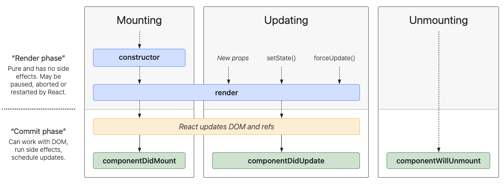
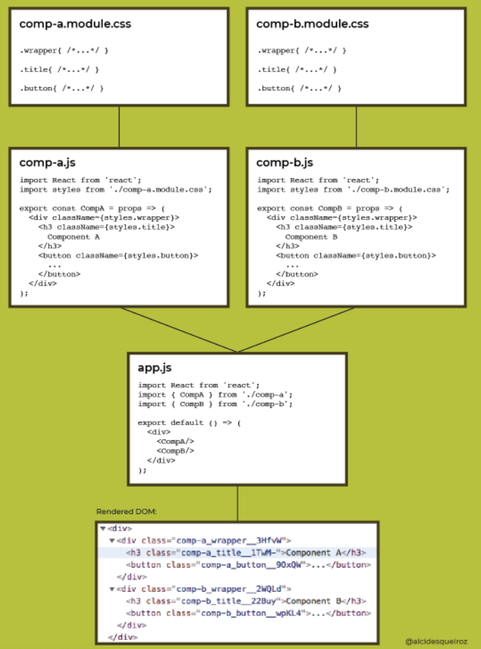

## Movie Reviewer Database App - Part 3


## Component Life Cycle Methods

When writing React components, we sometimes need access to lifecycle events to handle a variety of side effects: fetching data on mount, sanitizing props when the component updates, cleaning up before the component unmounts, etc.

Until React 16.8, the most common solution for handling lifecycle events required `ES6 class-based components`. Class components gave React developers access to the most common lifecycle methods: componentDidMount, componentDidUpdate, and componentWillUnmount.



- Mounting — The component is created and then inserted into the DOM
- Updating — A React component is updated via changes in props or state.
- Unmounting — The component is removed from the DOM.
- Error Handling — When there's a bug, the component is in the error

These 'lifecycle' methods available only in `class components`, were used to to inject code during the `component lifecycle`.

- ```componentDidMount()``` runs after the component is mounted and rendered to the DOM
- ```componentDidUpdate()``` runs after the updating happens. This one is called always except for the initial render. 
- ```componentWillUnmount()``` run just before the component is removed from the DOM. 

The issue with these class-based component lifecycle methods were re-usability (e.g. must be a member to the class itself) which cause additional complexity on building React applications to scale for maintainabity and re-use.

But starting with React version 18, <a href="https://reactjs.org/blog/2019/02/06/react-v16.8.0.html">hooks were added</a>. Those lifecycle methods that were used within class components were replaced with various React hooks. 🤓

## React Lifecycle using Hooks


You can take advantage of the ```useEffect hook``` to achieve the same results as with the componentDidMount, componentDidUpdate and componentWillUnmount methods. 

useEffect accepts two parameters. The first one is a callback which runs after render, much like in componentDidMount. The second parameter is the effect dependency array. If you want to run it on mount and unmount only, pass an empty array [].

### useEffect hook

The `useEffect` hook allows injection of code at the end of the `mounting stage` where the component just rendered to the DOM. It also can be run whenever state changes and forces the component to the `updating` stage and re-renders to the DOM.

So you can say `loosely` that useEffect hook has the same functionality as the lifecycle method of componentDidMount() and componentDidUpdate().

<a href="https://en.wikipedia.org/wiki/Side_effect_(computer_science)">Side effect</a> (often simply called effect) isn't a term that's specific to React. It's a general concept about the behavior of a function. 

For example, a function that modifies a DOM element is introducing a side effect; the DOM element doesn't belong to the scope of the current function. If you aren't using React to update the state or render HTML, that's a side effect. Basically, it's any non-React thing.

The useEffect hook lets you perform side effects in functional components. It performs an action once the page loads for the first time (e.g. fetching requests). 

The useEffect() hook accepts two arguments:

 - A function to run the effect
 - An optional array of dependencies for the effect function. These values determine when to rerun the effect.

After each rendering—and after updating the DOM—React invokes the function passed to useEffect().

```JS
import React, {useEffect} from 'react';

useEffect(() => {
    // put your code here
  }, dependencies)
```

#### When is the effect rerun?

The optional second parameter to useEffect() — the array of dependencies for the effect function — controls when the effect reruns. React has three different options for when the effect is rerun, and you'll learn about all three of these options next.

 - By default, useEffect() runs after the first render and after every change to props or state.
 - Run the effect once (adding [] as a dependency)
 - Run the effect when a value changes (add state variable in [state variable])

Here is an example of using useEffect to make an API call:

```JS

const [user, setUser] = useState({});

useEffect(() => {
    async function loadUsers() {
      const response = await fetch(
        "https://jsonplaceholder.typicode.com/users/1"
      );
      const userFromAPI = await response.json();
      setUser(userFromAPI);
    }
    loadUsers();
  }, []); // Passing [] so that it only runs the effect once

  if (user.id) {
    // conditionally render after useEffect completes:
    return (
       ...
    );
  }
});
```

#### Why is useEffect() needed for API calls?

You might be wondering why you can't call fetch() directly rather than wrapping it in useEffect()?

Consider what would happen if you didn't use useEffect(). 

The component would be rendered, triggering a call to fetch(), which would eventually call setUser() and update the state. Every call to update the state would trigger a re-render. The re-render would trigger another call to fetch(), and so on. The code would then be stuck in an infinite re-rendering loop. The same thing will happen if you omit the empty array as the second parameter.

### Conditional Rendering

Conditional rendering is a term to describe the ability to render different user interface (UI) markup if a condition is true or false. In React, it allows us to render different elements or components based on a condition.

This concept is applied often in the following scenarios:

 - Rendering external data from an API.
 - Showing or hiding elements.
 - Toggling application functionality.
 - Implementing permission levels.
 - Handling authentication and authorization.

 You can use JavaScript operators like `if` or the `conditional (ternary) operator` to create elements representing the current state, and let React update the UI to match them.

```JS
function Greeting(props) {
  const isLoggedIn = props.isLoggedIn;
  if (isLoggedIn) {
    return <UserGreeting />;
  }
  return <GuestGreeting />;
}

function Mailbox(props) {
  return (
    <div>
      {unreadMessages.length > 0 &&
        <h2>
          You have {unreadMessages.length} unread messages.
        </h2>
      }
    </div>
  );
}

function Login(props) {
  return (
    <div>
      {props.isLoggedIn
        ? <LogoutButton onClick={handleLogoutClick} />
        : <LoginButton onClick={handleLoginClick} />
      }
    </div>
  );
}
```

## Styling

There are many ways (aka methodologies) to style a React application.


### Modern Component Architecture

There are a few “hard problems” when it comes to CSS. One of the very hardest has to do with CSS global nature: how do we structure large applications to avoid specificity wars and naming collisions? How do we identify which styles affect a given element?

### CSS Stylesheets 

Writing CSS in a stylesheet is probably the most common and basic approach to styling a React application.

Plain CSS (CSS in CSS) would be accomplished by either having a global CSS file (App.css) and having all of your styles in that one file OR creating separate .css file per component. 

> The problem with creating a separate .css file per component is possible name conflicts and specificity issues. 

```CSS
/* global.css */

.button {
  width: 200px;
  border: none;
  background-color: aqua;
}
```

```JS
import "./global.css";

export default function App() {
  return (
    <>
      <button className="button">I am a button</button>
    </>
  );
}
```
### Inline Styling

Inline styling works the same for HTML documents as it does for React. The difference is that you need to create an object to pass the CSS properties that you want.

The properties in the ```styles``` object must be camelCase style because kebab-case doesn't fit because of syntax rule. - is not allowed in identifier.


```JS
const styles = {
  width: 200px,
  border: none,
  backgroundColor: blue
};

const Button = () => (
  <button style={styles}>This is a button</button
)
```

> Some of the drawbacks of inline-styling in React is the complexity for adding pseudo-selectors (e.g. :hover), inability to pass props, non-support of media queries, 

### CSS Modules

<a href="https://developer.adobe.com/commerce/pwa-studio/guides/general-concepts/css-modules/
">CSS Modules</a> are .css files in which all class names are scoped locally by default.

CSS Modules are not part of the CSS Spec or browser API. It is part of the build process of webpack or other module bundlers (Parcel, Vite, etc). 

CSS modules give you the ability to control your element styles in a more granular way. They allow you to build different layers of styles while building your application using a modular approach. 

A CSS Module is simply a .css file, where classes act similarly to local variables in Javascript. 

The build tools (Create-React-App) transforms your class names into variables that are exported separately as ```named exports``` and as an ```object```. Another CSS file gets generated and then mapped to the associated const . As a result, your CSS is specifically scoped to the space it is used.

> By default CSS Modules are scoped only to classes. This means that #id and global selectors are not processed by CSS Modules. However, descendants of classes are scoped. For example, .container img will be scoped by CSS Modules but img on its own will not.

<strong>Naming</strong>

CSS Modules naming convention <a href="https://github.com/css-modules/css-modules#naming">recommends camelCasing</a>, and not using dashes or underscores in the CSS class selector names. This following JavaScript naming conventions for class member naming.

You can either:

 - Use dashes or underscores in CSS selector names, but in JSX use brackets `[]` wrapped around the name prefaced by the object referencing the .css file.
 - Use camelCasing for your CSS selector names in your .css file.

 ```JS
// Movie.module.css: 
.movie-list {

// Movie.jsx: 
import style from './Movies.module.css';

<div className=style['movie-list']>{movie}</div>
 ```

Reference: <a href="https://github.com/css-modules/css-modules#naming">https://github.com/css-modules/css-modules#naming</a>



```CSS
/* Button.module.css  */

.button {
  width: 200px;
  border: none;
  background-color: blue;
}
```

```JS
/* Button.jsx */

import styles from "./Button.module.css";

const Button = () => {
  return <button className={styles.button}>This is a button</button>;
};

export default Button;
```

```JS
import "./Button.jsx"

export default function App() {
  return (
    <>
      <Button>I am a button</button>
    </>
  );
}
```

### CSS-in-JS

There are a few popular libraries to do CSS-in-JS such as <a href="https://styled-components.com/">styled components</a>, and <a href="https://emotion.sh/docs/styled">Emotion</a>. CSS-in-JS is not a specific library, it’s a concept that tries to solve the problem of styling in React applications.

Styled-components are designed to eliminate the mapping between components and styles, so when you’re defining your styles, you’re really just building a regular React component with your styles attached.

 styled-components use <a href="https://developer.mozilla.org/en-US/docs/Web/JavaScript/Reference/Template_literals#tagged_templates">tagged template literals</a> in JavaScript to style components. Tagged template literals allows you to parse template literals with a function. It is powered by tagged templates and allows to create normal React components by only defining styles.

<strong>Install the Styled Components package:</strong>

```
npm i styled-components
```

<strong>Import into component</strong>

```JS
import styled from "styled-components";
```

<strong>Create style object and use inline</strong>

```JS
const StyledButton = styled.button`
   width: 200px;
   border: none;
   background-color: grey;
`;

const Button = () => {

  return <StyledButton>This is a button</StyledButton>;
}
```

Here, ```StyledButton``` is the styled component, and it will be rendered as an HTML button with the contained styles. ```styled``` is an <a href="https://styled-components.com/docs/api#styled">internal utility method</a> that transforms the styling from JavaScript into actual CSS.

> The only issue against CSS-in-JS libraries involves performance. These libraries do some relatively heavy lifting under the hood: compiling and interpolating props for styling directives in tagged template literals, building a graph of managed elements, preprocessing CSS, and injecting the CSS into the page. So for large-scale React applications, it could be an issue, but generally the performance hit should be minimal.

## React Component Folder Structure

React projects tend to get larger and more complex over time. The more files you have in the project, the more important it becomes to organize those files in a way that makes it easy to do the following:

 - Find and modify existing code
 - Add new code in a location consistent with the existing code

Bear in mind that keeping all of your components in the src folder will get overwhelming, even for small applications. There are no rules about how to organize your code. Simply do what makes sense for you. Though there are some <a href="https://reactjs.org/docs/faq-structure.html">common patterns</a> that are very popular in the React ecosystem you may want to consider.

## References
 - CSS Element Generators:
   - [Button Generator](https://www.bestcssbuttongenerator.com/)
   - [Another Button Generator](https://cssbuttoncreator.com/)
   - [Box-Shadow Generator](https://html-css-js.com/css/generator/box-shadow/)
   - [Another Box-Shadow Generator](https://developer.mozilla.org/en-US/docs/Web/CSS/CSS_Backgrounds_and_Borders/Box-shadow_generator)
 - [CSS Modules Documentation](https://github.com/css-modules/css-modules) 
 - [CSS Modules - Create React App](https://create-react-app.dev/docs/adding-a-css-modules-stylesheet/)
 - [Styled Components Documentation](https://styled-components.com/docs)
 - [Emotion Documentation](https://emotion.sh/docs/introduction)
 - [CSS-in-JS Explained](https://www.youtube.com/watch?v=ull9iCMTGDE)
 - [Using Styled Components](https://www.youtube.com/watch?v=pWps7PkrQaQ)
 - [useEffect Explained](https://dmitripavlutin.com/react-useeffect-explanation/)
 - [useEffect - W3Schools](https://www.w3schools.com/react/react_useeffect.asp)
 - [useEffect - Sony Sangha Youtube](https://www.youtube.com/watch?v=UVhIMwHDS7k)
 - [Conditional Rendering Explained](https://www.youtube.com/watch?v=BMq69JNUZ_U)
 - [Conditional Rendering Reference - W3Schools](https://www.w3schools.com/react/react_conditional_rendering.asp)
 - [React Component Folder Structure](https://www.taniarascia.com/react-architecture-directory-structure/)
 - [React Hooks Lifecycle Diagram](https://github.com/Wavez/react-hooks-lifecycle)